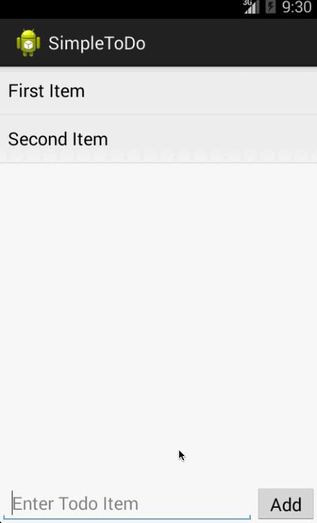
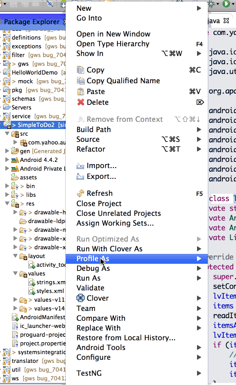

simpleToDoApp
=============

Simple ToDo List Android Application

This is an Android Application that is a Simple To Do List.  It features these exciting capabilities:

  1.  View a list of items
  2.  Add items to the list
  3.  Remove items from the list
  4.  Items persist across opening and closing of the app.

The first gif shows a walkthrough of the app with the first 3 features.
The second gif shows a walkthrough of relaunching the app, and having the previous items from the list persisted when re-opened.

